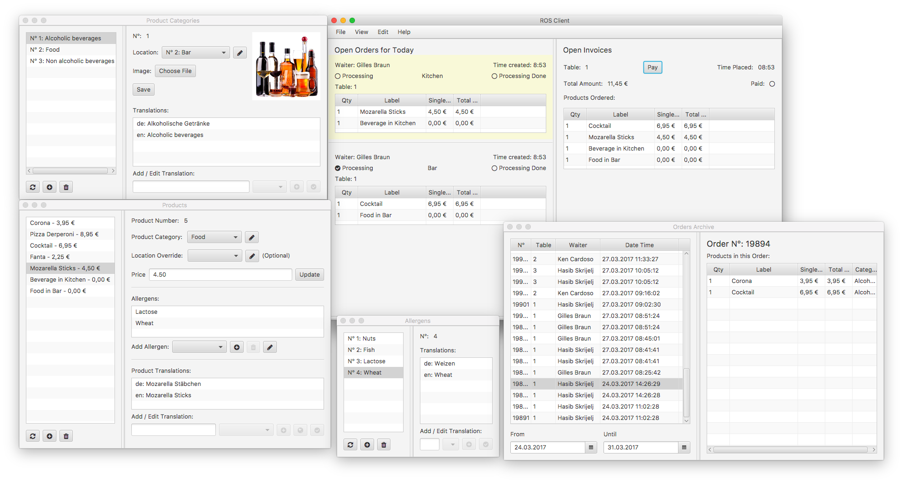
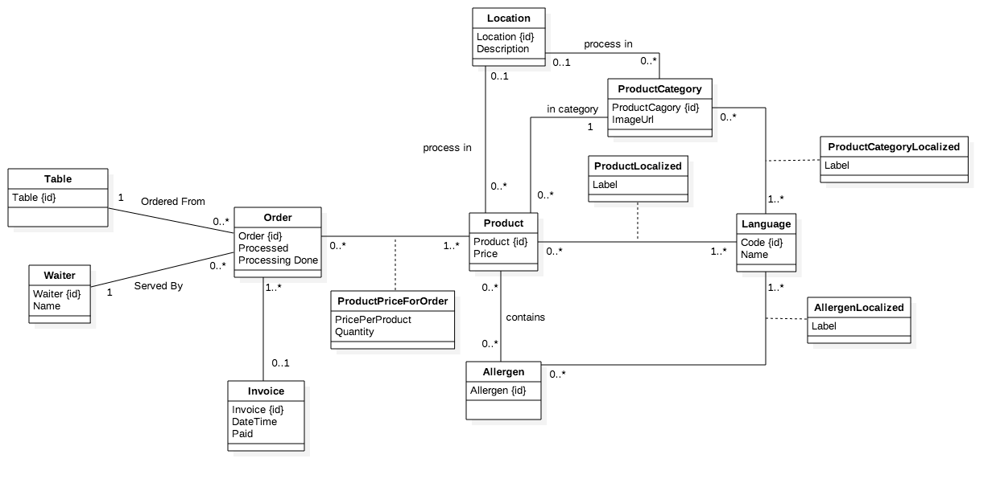

# Restaurant Ordering System
### © Gilles Braun 2017

[](https://gitlab.com/gillesbraun/RestaurantOrderingSystem/commits/master)
[Download latest build](https://gitlab.com/gillesbraun/RestaurantOrderingSystem/builds/artifacts/master/download?job=build)

## Getting Started
### Prerequisites
* MySQL Server 5.7
* Java 8 (Tested with 1.8.0_112)
* Android Tablet with at least 4.0.3 Ice Cream Sandwich

### Import Database
Connect to your MySQL Server and create a database. Let's assume the name of the new database is `ros`

It doesn't matter which name you choose as you can configure ROS application accordingly.

Navigate to the compiled server directory, and find the file called `create.sql`. Now execute the following command, while subsituting DB_NAME with your database name.

`mysql -u root -p DB_NAME < create.sql`

### Create DB User
It is recommended to create a MySQL user which only has access to the newly created database and that has a random password.

Connect to your MySQL server. And execute the following commands:

```sql
CREATE USER rosuser IDENTIFIED BY 'somerandompassword';
GRANT ALL ON DB_NAME.* TO rosuser;
```

## Start ROS Server
Navigate to the server directory.

* Windows: Start `server.bat`
* Mac/Linux: Start `server` (maybe `chmod +x` first)

Now configure the database settings in the config file that has been generated. The path of said config file should be printed in the console window.

## Screenshot


## Database Model
